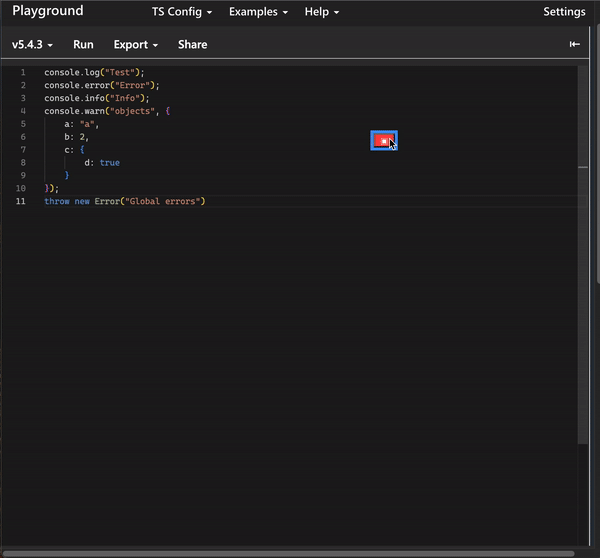

# Inspect Window

[](https://github.com/lanuaradiego/inspect-window/actions/workflows/build.yml)

**Inspect Window** is a web tool that allows you to visualize `Javascript` logs in real-time.



[Playground Example](https://lanuaradiego.github.io/inspect-window/example/index.html)

## Index

* [Use Cases](#use-cases)
* [Features](#features)
* [How to Use](#how-to-use)
* [Technologies](#technologies)
* [Build](#build)
  * [Prerequisites](#prerequisites)
  * [Build Process](#build-process)
* [License](#license)

## Use Cases

* Debugging web applications on mobile devices that have browsers without `devtools`.

## Features

* Real-time display of `Javascript` console logs:
  * `console.log`.
  * `console.info`.
  * `console.warn`.
  * `console.error`.
* Display all web page exceptions (`window.addEventListener("error")`).
* Display the timestamp when logs occur.
* Display the stacktrace of logs.
* Compatible with touch devices (`touch events`).
* Allow moving the log viewer window by dragging the window title bar.
* Allow resizing the log viewer window; Can be dragged from any of its sides or corners.
* Allow fullscreen display of the log viewer window from the button with square icon (`100vh` and `100vw`) and restore it to its previous position/size.
* Allow hiding it occupying minimum space so that, by pressing the button with cross icon again, its previous position/size is restored.

## How to Use

**Inspect Window** is extremely easy to use, simply import the `inspect-window.js` script within `<body>` for the tool to start collecting logs and map the global variable `inspectWindow`:

```html
<body>
 <script src='inspect-window.js'></script>
</body>
```

Then simply call to show the log viewer window from `Javascript`:

```javascript
inspectWindow.show();
```

You can see this [Example](./example/index.html).

## Technologies

* VanillaJS
* Typescript
* Webpack
* NodeJS

**Inspect Window** does not use external dependencies.

## Build

### PreRequisites

1. Install [Node.js](https://nodejs.org/en/download/current) version 16.x.x or higher.

### Build Process

1. Install dependencies from terminal:

   ```bash
   npm i
   ```

2. Compile from terminal:

   ```bash
   npx webpack --config webpack.config.prd.js
   ```

The result will be found in `dist/inspect-window.js`.

## License

**Inspect Window** is [Mit Licensed](./LICENSE)
